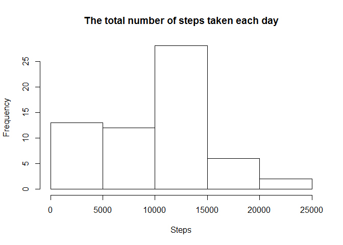

# Reproducible Research: Peer Assessment 1
Irina Telina  
16.07.2015  

```
## Loading required package: knitr
```
### Loading the data:


```r
df <- read.csv("./activity.csv", header = TRUE, stringsAsFactors = FALSE)  
```

## What is mean total number of steps taken per day?


```r
library(dplyr)  
dfDay <- group_by(df, date)  
TotalStepsDay <- summarize(dfDay, total_steps = sum(steps, na.rm = TRUE))  
hist(TotalStepsDay$total_steps, main = "The total number of steps taken each day", xlab = "Steps")  
```

 

```r
mean_steps <- round(mean(TotalStepsDay$total_steps), digits = 2)    
median_steps <- median(TotalStepsDay$total_steps)  
```

The mean of the total number of steps taken per day is **9354.23**.
The median of the total number of steps taken per day is **10395**.

## What is the average daily activity pattern?


```r
dfInterval <- group_by(df, interval)
AvgStepsInterval <- summarise(dfInterval, avg_steps = mean(steps, na.rm = TRUE))
plot(AvgStepsInterval$interval, AvgStepsInterval$avg_steps, type = "l", main = "The average number of steps", xlab = "5-minute interval", ylab = "Averaged number of steps across all days")
```

 

```r
max_steps <- max(AvgStepsInterval$avg_steps)  
interval_max_step <- round(AvgStepsInterval[AvgStepsInterval$avg_steps == max_steps,1], digits = 2)  
```

The 5-minute interval # **835** contains the maximum number of steps, on average across all the days in the dataset.

## Imputing missing values

The total number of missing values in the dataset is **2304**.

Filling in the missing values with the means for 5-minute intervals:

```r
df1 <- df
for (i in seq_along(df1$steps)) 
{
    if(is.na(df1[i,"steps"])) 
    {
        df1[i,"steps"] <- AvgStepsInterval[AvgStepsInterval$interval == df1[i,"interval"], "avg_steps"]
    }
}
```

Making a histogram of the total number of steps taken each day:

```r
dfDay1 <- group_by(df1, date)  
TotalStepsDay1 <- summarize(dfDay1, total_steps = sum(steps))  
hist(TotalStepsDay1$total_steps, main = "The total number of steps taken each day", xlab = "Steps")  
```

 

```r
mean_steps1 <- mean(TotalStepsDay1$total_steps) 
median_steps1 <- median(TotalStepsDay1$total_steps)   
```

The mean of the total number of steps taken per day is **10766.19**.  
The median of the total number of steps taken per day is **10766.19**.  
These values differ from the estimates from the first part of the assignment:  
- the mean of the total number of steps taken per day was 9354.23;  
- the median of the total number of steps taken per day was 10395.  

The impact of imputing missing data on the estimates of the total daily number of steps consists in smoothing of the total number of steps distribution. 

## Are there differences in activity patterns between weekdays and weekends?


```r
df1$date <- strptime(df1$date, "%Y-%m-%d")
df1 <- mutate(df1, dayF = factor((weekdays(df1$date, abbreviate = TRUE) %in% c("Sat", "Sun")), labels = c("weekday", "weekend")))
AvgStepsInterval1 <- df1 %>% select(-date) %>% group_by(dayF, interval) %>% summarise(avg_steps=mean(steps))
library("ggplot2")
g <- ggplot(AvgStepsInterval1, aes(interval, avg_steps))
g + geom_line() + 
    facet_grid(dayF~.) + 
    labs(title = "The average number of steps", x = "5-minute interval", y = "Averaged number of steps across weekdays or weekends")
```

 
